# HomePoint

## Two-sided marketplace for drone pilots

## Visit website: [HomePoint](https://homepoint-app.herokuapp.com/)

### Repo: [HomePoint-app](https://github.com/malanchristiansen/HomePoint-app)

## **Problem**

1. No community exists for drone pilots to share and sell their photographs on a hobby level
1. Increasing demand for for artsy/creative photographs to decorate people’s homes
1. Drone photographs are sold in art galleries / photo shops at an often very expensive price above $500 AUD for printed photo and often more for framing.

## **Solution**

1. Niche marketplace for buyers ans sellers of drone photographs
   - Photos taken with drones are already in high scalable quality
   - The marketplace offers sellers to sell the raw file, printed version, or printed version as framed.
1. Drone pilots are given a channel to sell their photographs
1. People can buy cheap photographs and choose betwween versions for their own needs.

## **Description**

- **Purpose:** Help drone pilots share and sell their photographs and give people who are into photography a cheaper often to photographs
- **Functionality/Features:**

  - Users first have to authenticate using email and password
  - Users can create profiles to create a listing and users can create profiles to register as buyer or do both.
  - Users can create a listing for a drone photograph as a seller filling out information about it and uplaoding a photo
  - Sellers can also edit, update, delete their listing
  - All users can browse listings with photogrophs and view them
  - Users can buy drone photographs from listings from other sellers, not their own
  - Users can leave reviews on listings they have bought a photograph from. They can also edit, update, and delete them.

- **Target audience:** Drone pilots and people who love photographs
- **Tech stack:** HTML, CSS, Ruby, Rails, AWS, Heroku

## **Screenshots:**

**Frontpage 1**

**Frontpage 2**

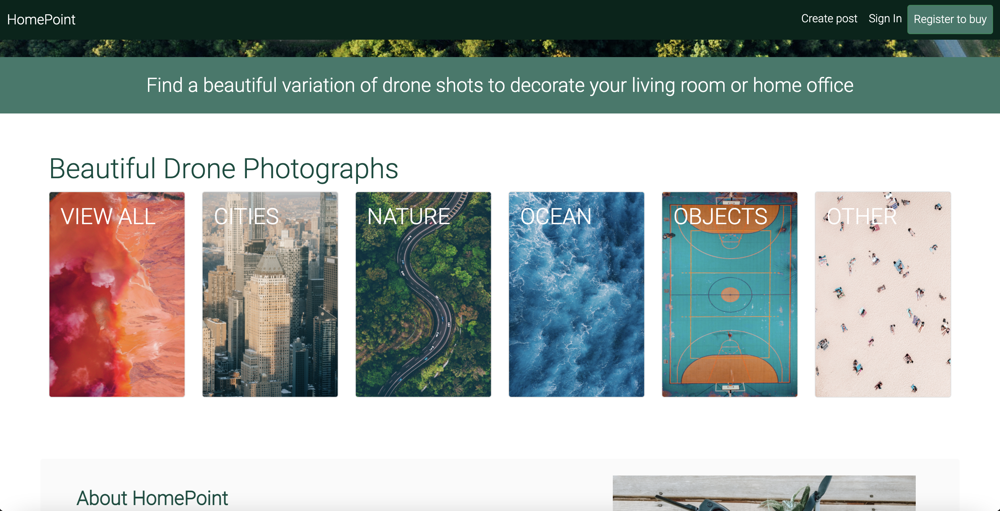

**Frontpage3**

**Browsing**

**Browsing category Ocean**

**Signup**

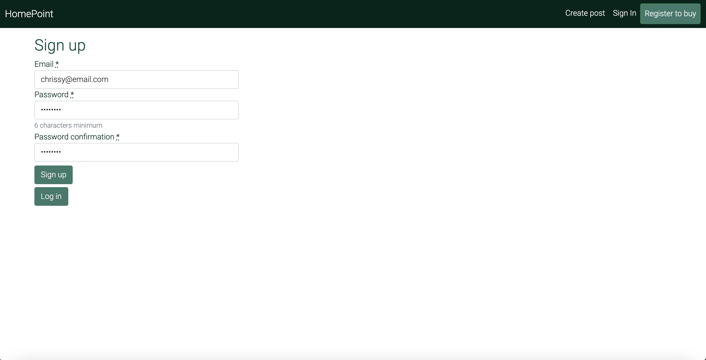

**Login**

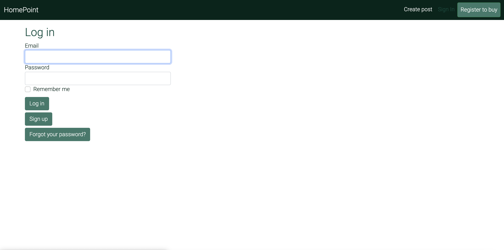

**Create profile**

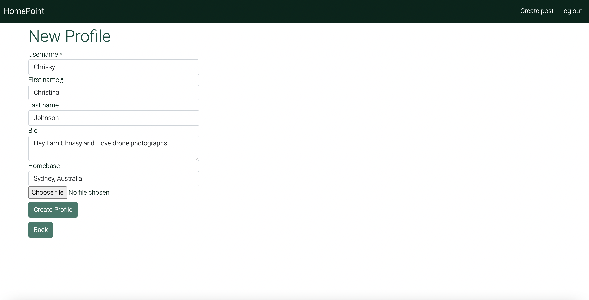

**Create Listing**

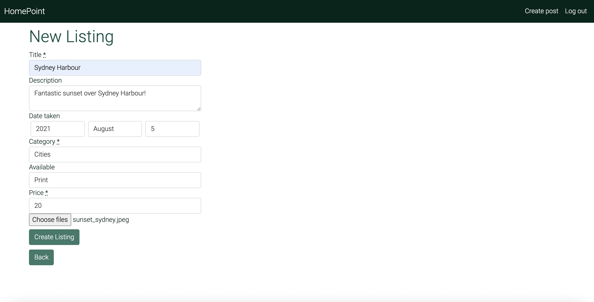

**View Listing**

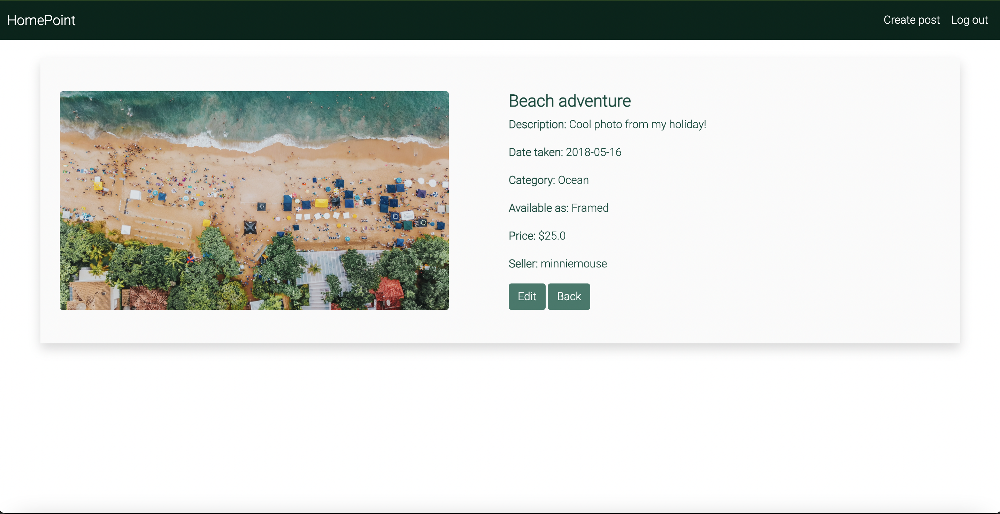

**Buy Listing**

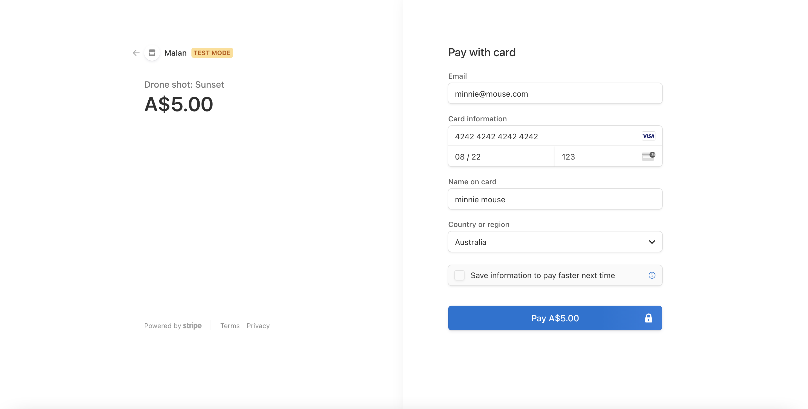

**Create Review**

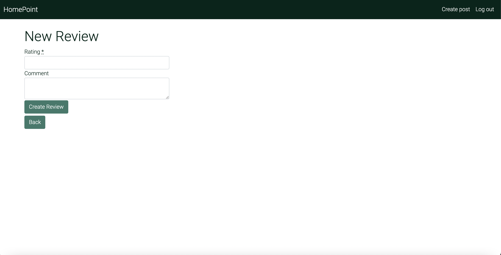

## **Sitemap:**

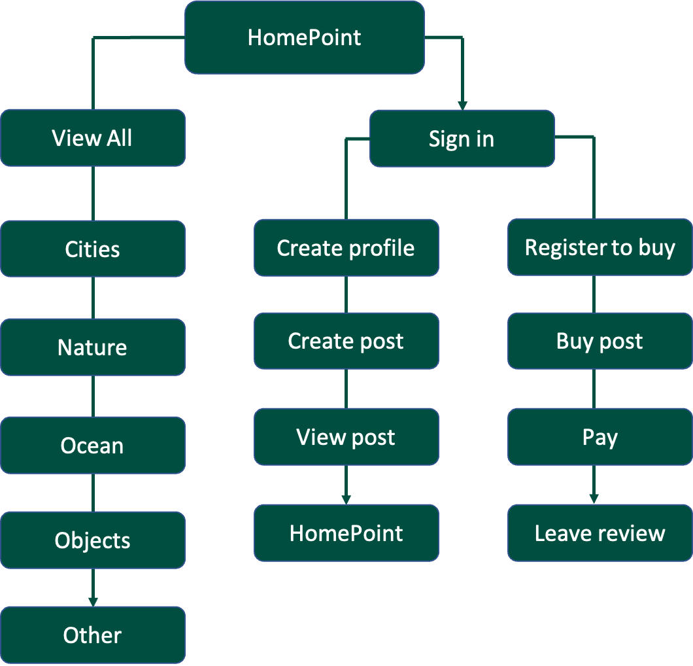

## **User stories**

- `"As a drone pilot, I want to have a platform where I can share my drone photographs"`

- `"As a drone pilot, I want to be able to sell my drone photographs"`

- `"As a drone photographer, I want to be apart of a community with other drone photographer and see their photographs"`

- `"As a working remote I want to decorate my home office with beautiful photos"`

- `"As a student I want to be able to but beautiful photographs at a cheap price"`

- `"As photography enthusiast I want to be apart of a community where I can see and but beautiful photographs"`

## **High level components of app**

- **Controllers**

  - User: Users are authenticated via email and password
  - Profile: Users can create profile
  - Listing: Users can create listings if they have a profile
  - Payment: Users with profiles can buy listings that are not theirs
  - Review: Users who are buyers of listings can leave reviews on listings they have bought from.

- **Views**

  - Home: shows the landing page of the market place
  - Listings: shows the forms that users can fill out for creating, editing, and updating a listing of a photograph.
  - Profiles: shows the forms that users can fill out for creating, editing, and updating their profiles.
  - Reviews: shows the forms that users can fill out for creating, editing, and updating their reviews on listings they have bought from.
  - Partials: shows the shared components of the website. The navbar is included and showed on every page along.

- **Models**

  - Users: is associated to have one profile and associated with the gem devise to authenticate users and allows the controller to get access to user data
  - Profile: is associated to belong to users and can make reviews. Profile also has polymorphc relation to let users upload an image to their profile. Profile also is associated to Listing with a seller id and buyer id because of a self join. Gives the profile controller access to profile data.
  - Listing is associated to the profile table with a self join that has two foreign keys that represents the buyer id and seller id in the profile table. Listing is also associated to reviews and have a polymorphic relation to let users upload a drone photograph. Gives teh listing controller
  - Review: is associated to listing and profile as user and gives the reviews controller access to review data

## **Third party services**

- Image uploading of drone photographs and profile photos using [AWS S3 Bucket](https://aws.amazon.com/s3/?nc2=h_ql_prod_fs_s3)
- Payment for users to buy the photograph using [Stripe](https://stripe.com/au?utm_campaign=paid_brand-AU_en_Search_Brand_Stripe-908244709&utm_medium=cpc&utm_source=google&ad_content=301607044450&utm_term=aud-491317517717:kwd-295607662702&utm_matchtype=e&utm_adposition=&utm_device=c&gclid=CjwKCAjwx8iIBhBwEiwA2quaq2tCmBEvQGQtbyOjdBHa9_26C_3DFLAA7shoUe9M8IxE0JdiNS_MKBoCUVcQAvD_BwE)
- Overall styling and responsive design of the app using the [Bootstrap gem](https://github.com/twbs/bootstrap-rubygem/blob/master/README.md)
- Generating forms using [Simple_form gem](https://github.com/heartcombo/simple_form)
- Authentication of users of app using the [Devise gem](https://github.com/heartcombo/devise)

## **Wireframes**

**Frontpage**
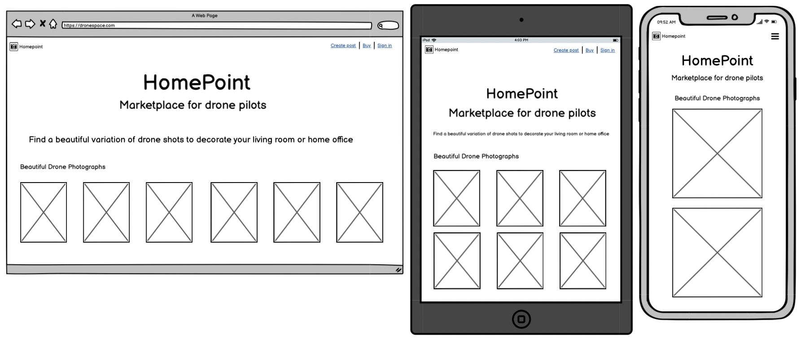

**View all categories**
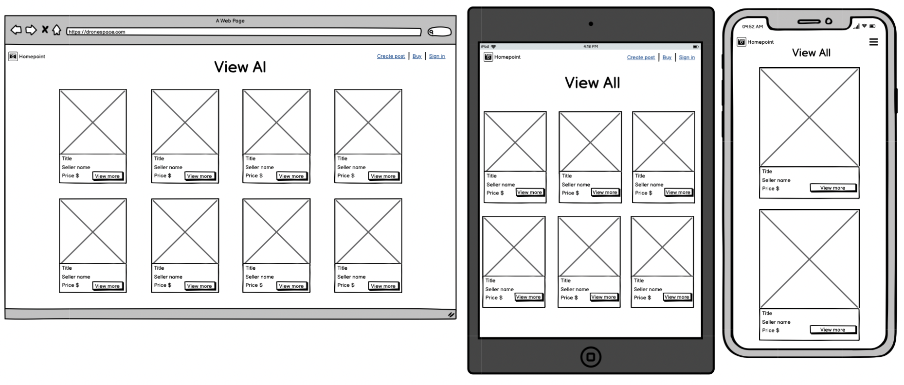

**View specific category**
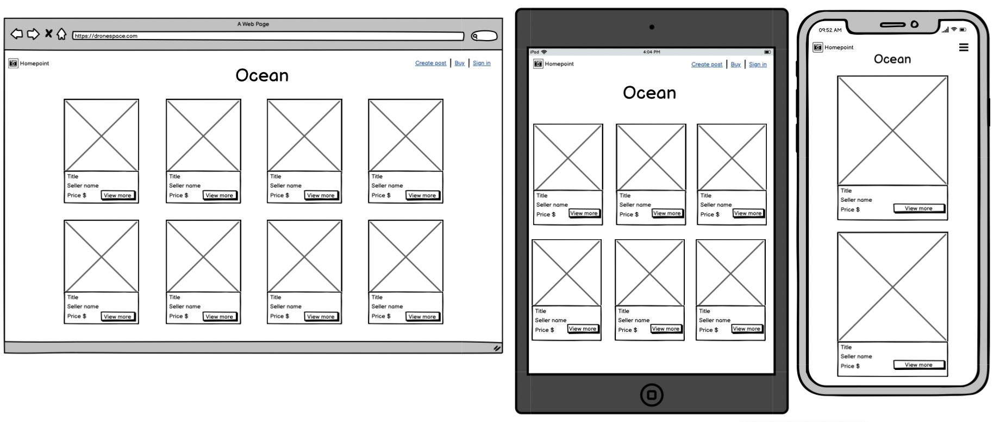

**Create profile**
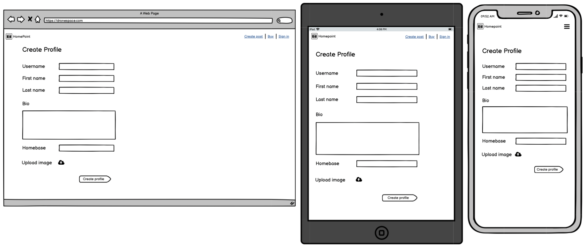

**Create listing**
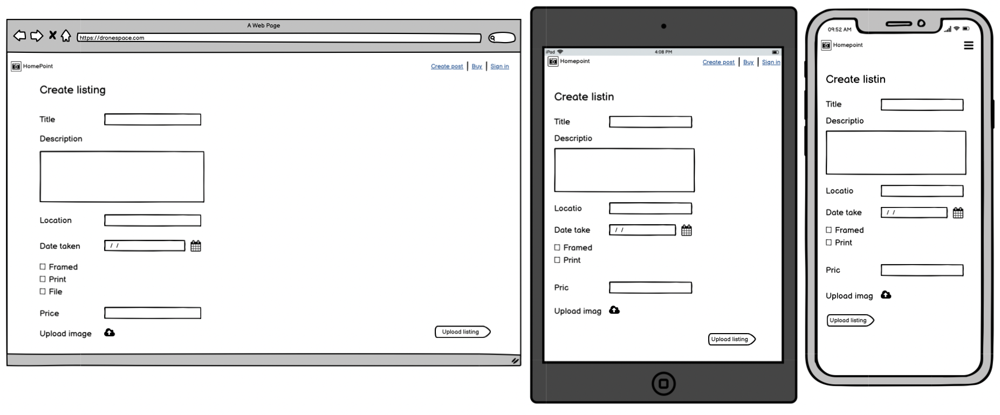

**View listing**
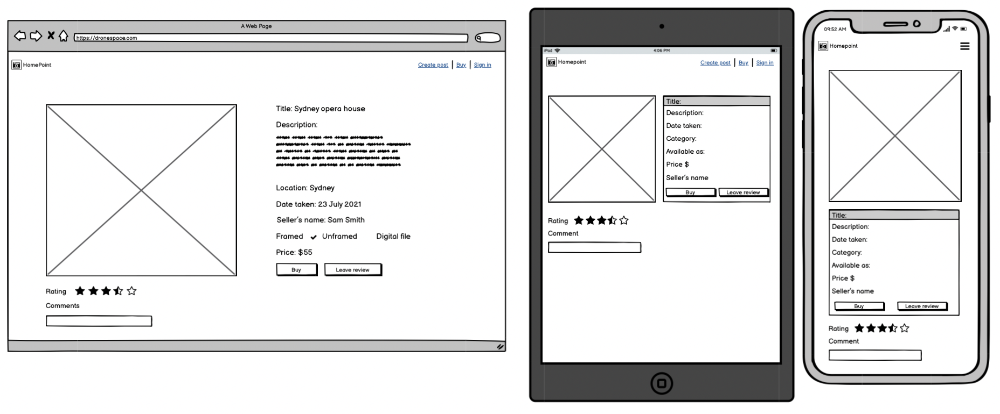

**Create review**
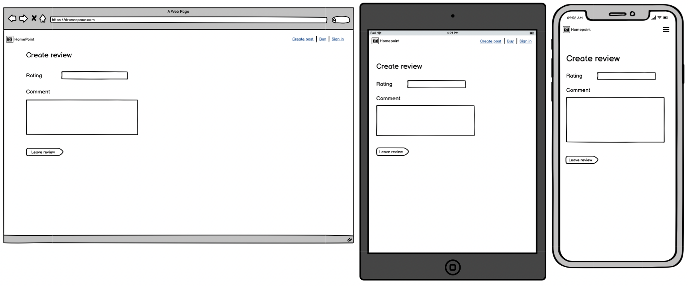

## **Initial ERD**

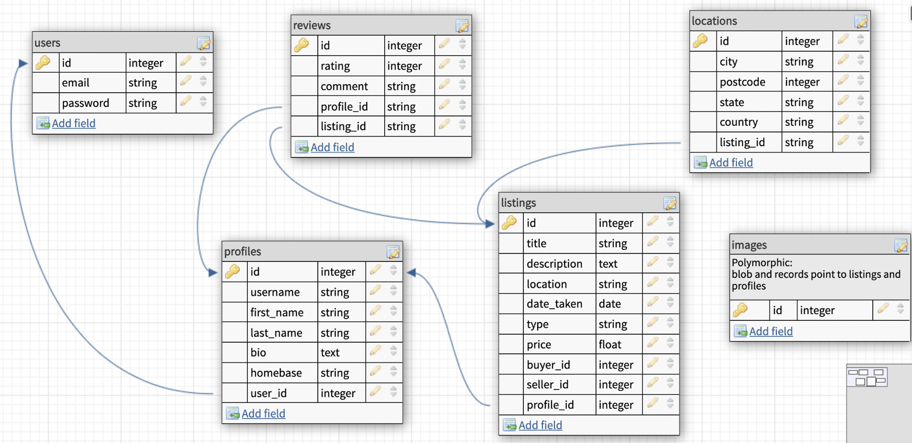

## **Models**

- **User:**
  - includes the devise gem for authentication, and has_one :profile, because one user can one have one profile
- **Profile:**
  - has a belongs_to :user relatioinship, because you need to have a user to create a profile.
  - has a has_many :reviews relationship because, a profile can leave maby reviews for different listings
  - has a has_one_attached :avatar polymorphic relationship, which means that a profile can upload a profile photo
  - has a has_many :photographs_to_buy relationship beacuse each profile can buy many photographs. It also has a classname of listing, as it is associated with the listing table and the foreignkey buyer_id
  - has a has_many :photographs_to_sell, class_name: "Listing", foreign_key: "seller_id", because each profile can sell many drone photographs. It also has a classname of listing, as it is associated with the listing table and the foreignkey seller_id
- **Listing:**
  - has a belongs_to :buyer, class_name: "Profile", optional: true because it is associated with the profile table. The optional tag is added because the listing may not have a buyer yet.
  - belongs_to :seller, class_name: "Profile" because it is associated with the profile table as a seller. Here it is not optional, as the listing must always have a seller.
- **Review:**
  - has a belongs_to :listing because a review cannot exist without a listing
  - has belongs_to :profile, beacuse a review cannot be created without a profile that has a buyer_id

## **Database relations**

- For the database relations the first table is users table that entails the attributes id as PK(which is automatically assigned when generating a table), email and password for users to be authenticated.
- Following the user table, a profiles table was created to store more details information about the user including an id, username, first_name, last_name, bio:text, homebase, and user:references, which is a FK that leads bacl to the user table.
- The listings table entails the most information and most complex realtions with a self join. It has an id, title, description, date_taken:date, category, available, price:float, profile:references, seller_id:integer, and buyer_id:integer
- Reviews table has an id, rating:integer, comment:description, listing:references, and profile:references as it will belong to the profile id of the user that writes the review and belong to the listing id it is reviewing.
- Active_storage_blobs and Active_storage_attachments and which is generated via rails active_storage:install.

**Database schema design (final ERD)**

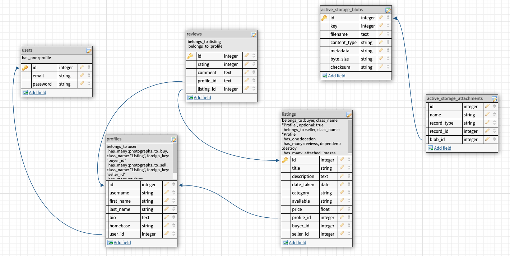

**Project planning - Trello**

- Using Trello to track progress and stay on track with project for deadline
- Trello board: [Marketplace app](https://trello.com/b/GVGY7seA/marketplace-app)
- Divided tasks into different list:
  - Documentation
    - Added all the documentation related cards in this list, such as user stories, description of features with a checklist etc.
  - Development
    - Added all the development related cards in this list, such as models, controllers, authorisation, category pages with a checklist etc.
  - In progress
    - All the cards that were in working progress were added to this list, e.g. when working on deployment to Heroku, the card was placed here.
  - Final touches
    - Added all the cards that needed final touches to this list, e.g. when working on layout but be able to fully tick of untill query of data were set up in a controller.
  - Completed
    - Added all completed cards in this list, e.g. when completing image upload to AWS, it was placed here.

## **Thanks for reading!**

